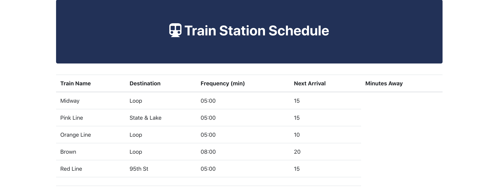
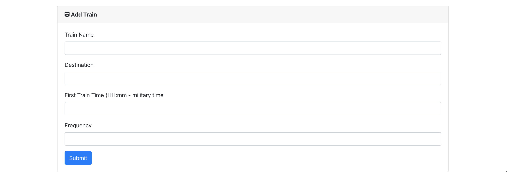
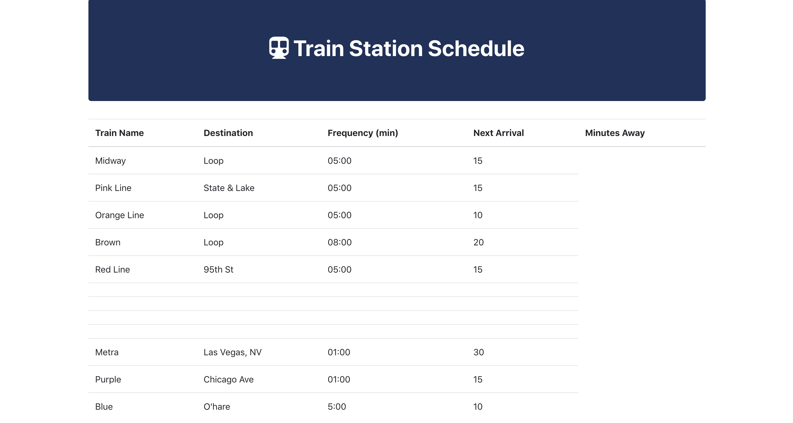

# Firebase Train Schedule

### Overview

This app is a train schedule application that incorporates Firebase to host arrival and departure data. The app will retrieve and manipulate this information with Moment.js. This website will provide up-to-date information about various trains, namely their arrival times and how many minutes remain until they arrive at their station.

- - -

### Setup

Fork the repo and open index.html on your browser and see the magic. 

#### The Train Station Schedule populates the scheduled times for each train.

#### In this section we can add a train and its details.

#### Once we add an additional train, this information will show and populate with the rest of the Train Station Schedule. 

